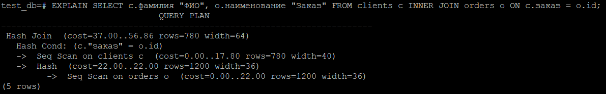
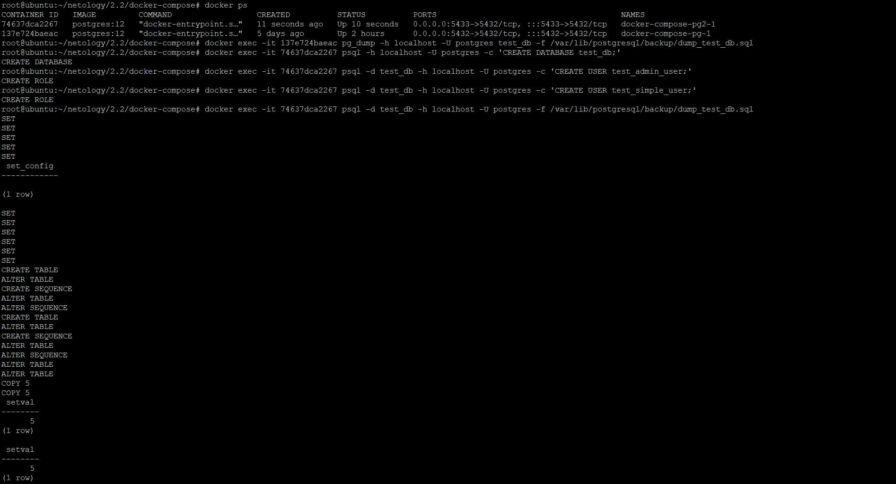
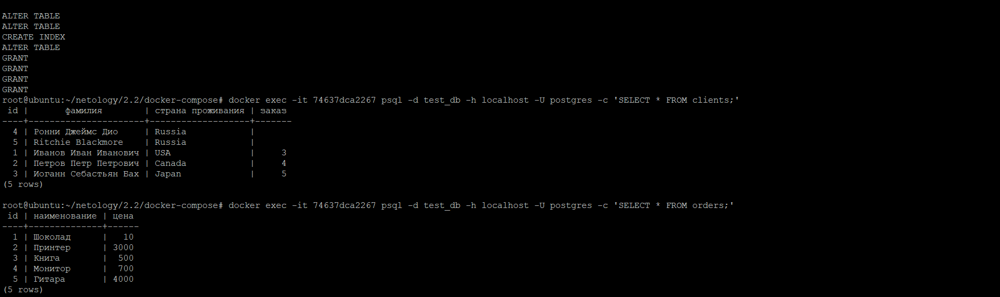

# Домашнее задание к занятию "6.2. SQL"
1. [Docker-compose манифест](./docker-compose/postgresql.yml).
2. Список БД:  
     
   Описание таблиц:  
     
   SQL-запрос и список пользователей:
   
3. Запросы и результаты их выполнения:  
     
     
     
4. Запросы добавления данных:  
     
   Запрос для вывода данных:  
   
5. Вывод explain:  
   
   В данном случае explain показывает шаги формирования ответа с некоторыми параметрами, а именно:
   Параметр | описание
   -------- | --------
   cost | Абстрактное число указывающее затраченное для выполнения время. Первое число - время затраченное на выполнения запроса первой записи таблицы, второе - всех записей.
   rows | Предпологаемое количество возвращаемых строк
   width | Предпологаемый средний размер одной строки в байтах
6. Последовательность действий по созданию и восстановлению из бекапа:  
     
   